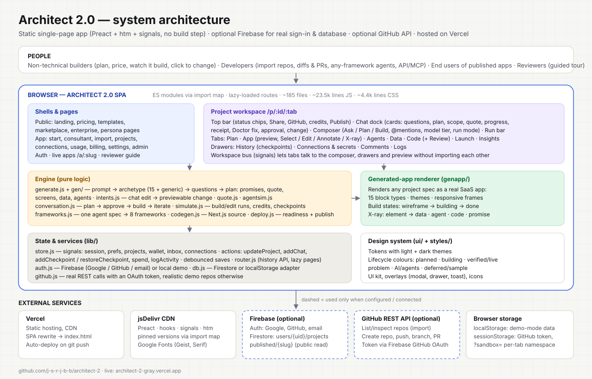
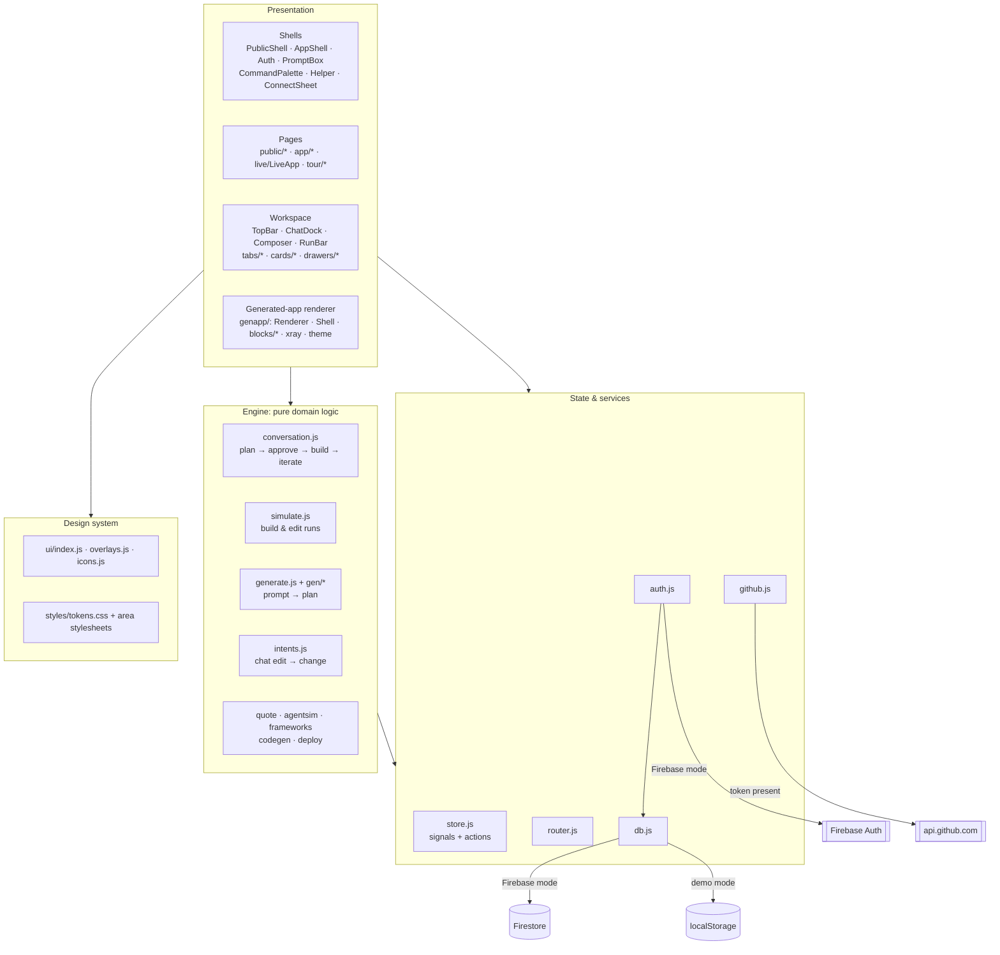
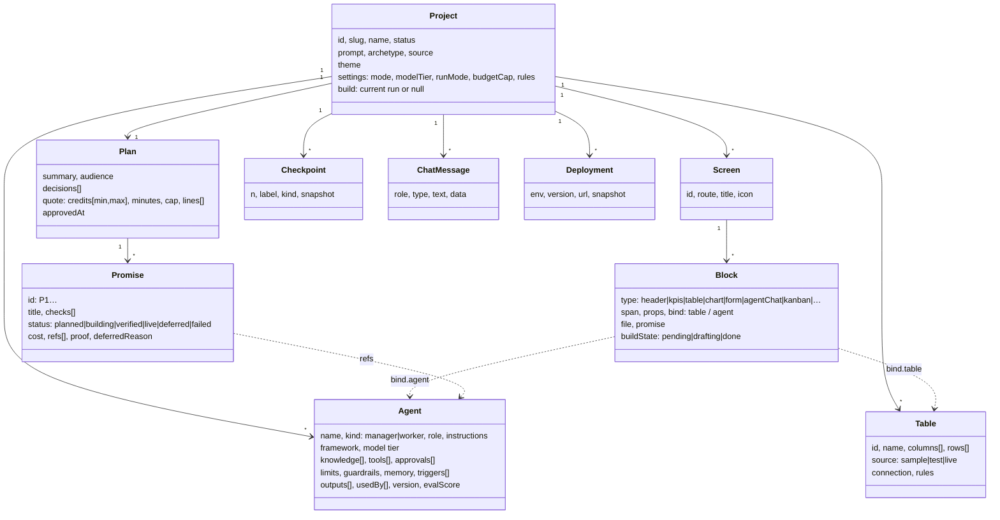
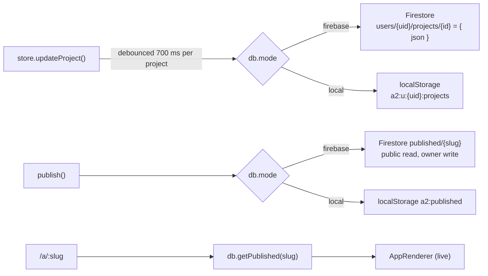
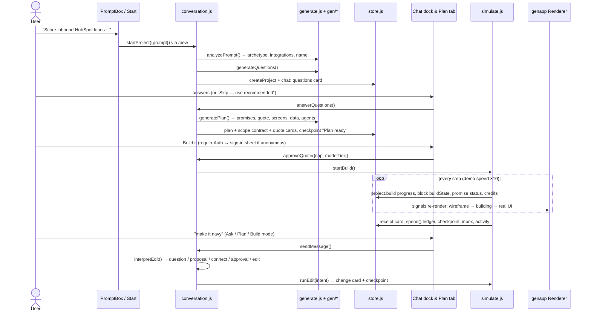
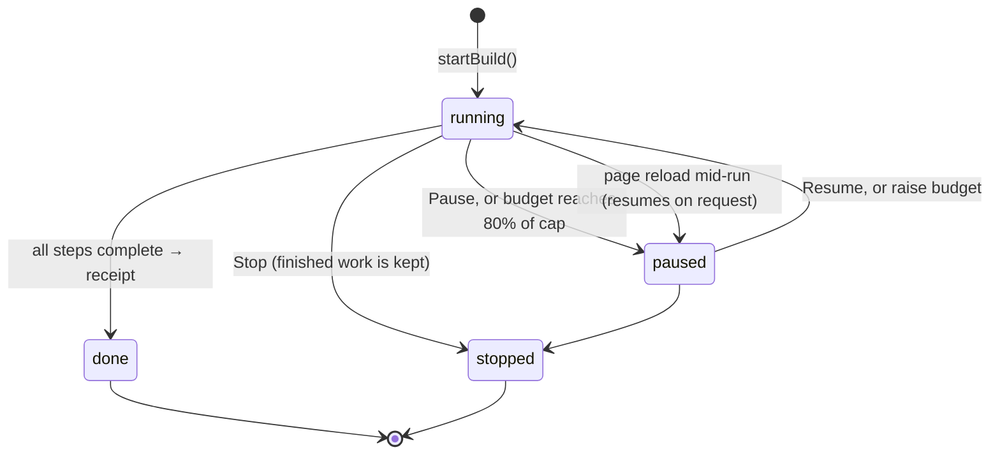
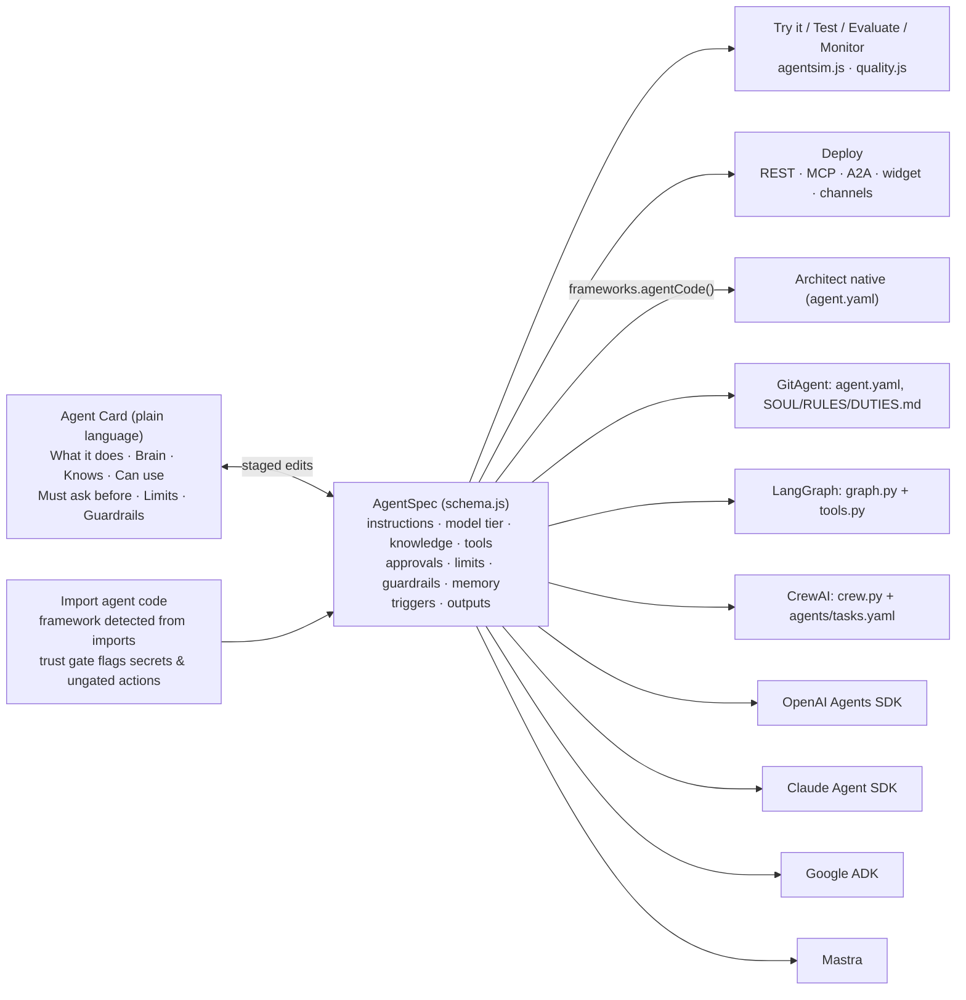
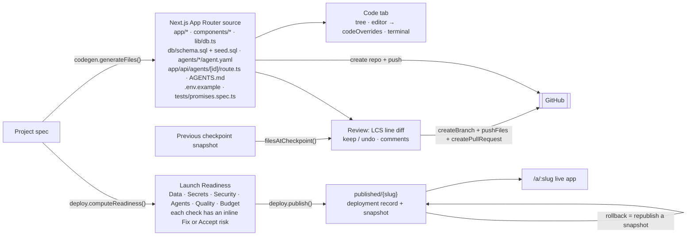
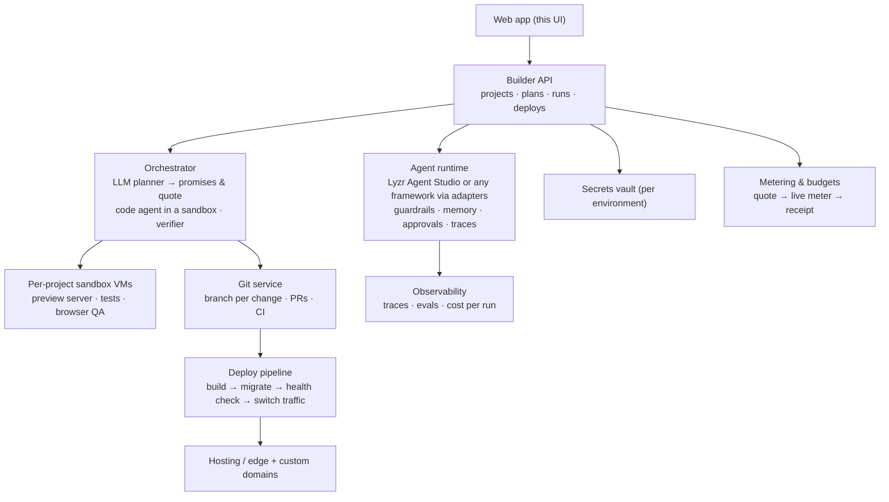

# Architect 2.0 — Architecture

> How the Architect 2.0 concept prototype is built: layers, modules, data model, the key runtime flows, and how it would map to a production system.
> Live: https://architect-2-gray.vercel.app · Repo: https://github.com/j-s-r-j-b-b/architect-2 · Product rationale: [`README.md`](README.md) and [`/tour`](https://architect-2-gray.vercel.app/tour)

---

## 1. At a glance

| | |
|---|---|
| **Type** | Static single-page app with no build step: native ES modules loaded through an import map |
| **View layer** | Preact 10 + htm (tagged-template JSX) + `@preact/signals` for reactive state, pinned from jsDelivr |
| **Size** | ~185 files: ~23.5k lines of JS and ~4.4k lines of CSS |
| **Persistence** | Adapter with two modes. **Firebase** (Auth + Firestore) when `src/config.js` has a config; **local demo mode** (localStorage) otherwise |
| **Integrations** | GitHub REST API (real when an OAuth token exists, realistic demo otherwise). Third-party OAuth connections are simulated and labelled |
| **"AI"** | A deterministic generator and simulators in `src/engine/`: no paid model key needed, and every result is grounded in the project's own data |
| **Hosting** | Vercel static hosting. `vercel.json` rewrites every path to `index.html`, and each push to `main` redeploys |

**Why no build step?** The prototype had to be built, run and deployed from a machine without Node.js. Import maps plus htm give component ergonomics close to JSX with zero tooling. Any static host can serve it, and every file is readable in the browser. The trade-offs (no tree-shaking, no TypeScript) are acceptable for a prototype.

---

## 2. Layers

**Rules that keep the layers clean**
- **All mutations go through `store.js` actions.** `updateProject(id, draft => …)` deep-clones, applies the change, stamps `updatedAt` and schedules a debounced save. Components never mutate signal values.
- **The engine holds the domain logic** (generation, intents, runs, readiness). Screens call the engine; the engine touches state only through store actions.
- **One project contract.** [`src/engine/schema.js`](src/engine/schema.js) defines the shape every module agrees on: promises, quote, screens/blocks, tables, agents, chat message types. [`src/engine/fixtures.js`](src/engine/fixtures.js) contains a complete example ("Lead Desk").
- **Decoupling via buses.** `src/shells/bus.js` holds the palette/help/mobile-rail signals. `src/workspace/bus.js` holds the composer prefill/context, drawer requests, preview state and console. Tabs can say "ask Architect to fix this" or "open History" without importing the chat dock.

---

## 3. Module map

| Folder | Lines | Responsibility |
|---|---:|---|
| `src/lib/` | ~1.1k | `html.js` (single Preact instance and re-exports), `router.js` (history API, `matchPath`, `Link`, `setQuery`), `store.js` (signals and actions), `auth.js`, `db.js`, `github.js`, `util.js` (formatters, safe storage with a `?sandbox=` namespace, downloads) |
| `src/ui/` | ~0.7k | UI kit (Button, Tabs, Segmented, Badge/StatusPill, Card, Menu/Popover, CodeBlock with a single-pass highlighter…), overlays (modal, drawer, toast, confirm), icon set |
| `src/engine/` | ~4.4k | `schema` (contract), `catalog` (integrations, MCP servers, frameworks, models, plans, themes, templates, personas), `fixtures`, `generate`, `quote`, `intents`, `agentsim`, `conversation`, `simulate`, `frameworks`, `codegen`, `deploy` |
| `src/engine/gen/` | ~2.4k | Prompt understanding (`detect`), shared builders (`kit`, `std`, `pools`, `text`) and **15 archetypes + a generic fallback**: sales, support, recruiting, onboarding, expenses, invoices, booking, commerce, content, knowledge, legal, claims, engineering, education, research |
| `src/genapp/` | ~1.8k | Renderer for the apps users build: app shell, 15 block types, themes, responsive frames, build states, X-ray, runtime event log |
| `src/workspace/` | ~8.8k | Project workspace frame, chat cards, drawers, and the seven tabs with their helpers (`plan/`, `preview/`, `agents/`, `code/`, `launch/`, `github/`) |
| `src/pages/` | ~3.4k | Public pages, app-shell pages, the live published app, the reviewer guide |
| `src/shells/` | ~0.8k | Shells, auth UI and `requireAuth()`, shared prompt box, connect/secret sheets, command palette, help slide-over, `/new` deep link |
| `styles/` | ~4.4k | `tokens.css` (light and dark), `base.css`, `ui.css`, then one stylesheet per area with a unique class prefix (`.ws-`, `.gx-`, `.ag-`, `.pl-`, `.pv-`, `.cd-`, `.ln-`, `.dt-`, `.in-`, `.ap-`, `.pb-`, `.tr-`) |

### Routing and shells

`src/app.js` holds a single route table. Each route has a lazy `load()`, a **shell** (`public`, `app`, `auto` = app when signed in, `bare`, or `workspace` = full-screen) and an optional `auth` flag, which redirects to `/login?next=…`. The page loader pairs each loaded module with its loader, so a stale page never renders on a new route. Pages are wrapped in an error boundary with a retry.

| Area | Routes |
|---|---|
| Public | `/`, `/pricing`, `/enterprise`, `/for/:persona`, `/templates(/:id)`, `/marketplace(/:slug)`, `/help`, `/tour` |
| Auth & entry | `/login`, `/signup`, `/onboarding`, `/new?prompt=&template=&skipPlan=` (works signed out), `/invite/:token` |
| App shell | `/start`, `/start/consultant`, `/start/import`, `/projects(/trash)`, `/agents`, `/connections/:tab`, `/inbox`, `/usage`, `/billing`, `/settings/:section`, `/admin/:section` |
| Workspace | `/p/:id/:tab/:a/:b`, with tabs `plan · app · agents · data · code · launch · insights` and drawers via `?panel=` |
| Published apps | `/a/:slug/*` (public; `?preview=1&project=` shows an owner's draft) |

---

## 4. Data model

Everything a user builds is **one Project document**. The fields are listed in `newProject()` in `store.js` and the types are documented in `schema.js`.

Also on the project:
- `integrations[]` and `env[]` (secrets per environment, stored only as masked markers);
- `environments` (draft / staging / production);
- `github` (repo, branch, branches, lastPush, prs);
- `comments[]`, `activity[]` (dual plain and technical summaries), `listing` (Marketplace);
- `codeOverrides` (hand-edited files).

**Account-level state**, in the user document:
- `prefs`, including `experience: guided|balanced|full`, which only sets defaults; nothing is ever locked;
- `wallet`: credits, a ledger with `FREE` entries, and budgets;
- `inbox`;
- `connections`: integrations, MCP servers, and bring-your-own model keys (the last 4 digits only).

---

## 5. Persistence and auth

- **Projects are stored as a JSON string** per document, so arbitrary nesting (arrays of arrays, `undefined`) survives Firestore's type rules. The 1 MB document limit is far above realistic project sizes.
- **Try before sign-up.** Anonymous work is saved under uid `anon`. On sign-in, `claimAnonProjects()` moves it to the account, so a plan made before sign-in is never lost. A brand-new account is seeded with the Lead Desk example and a welcome inbox item.
- **Auth modes.** In Firebase mode, auth uses `signInWithPopup` for Google and GitHub (GitHub asks for the `repo` scope, and the token is kept in **sessionStorage only**) plus email/password. Local mode creates a demo account instantly. Errors are mapped to plain-language messages.
- **Security rules** ([`firestore.rules`](firestore.rules)): a user can read and write only `users/{uid}/**`. `published/{slug}` is public-read and only its owner can write it.
- **Secrets are never stored in project data.** The secret sheet records a masked marker (last 4 characters) per environment, and agents "can use but never read" them.
- **Dev isolation.** Opening any URL with `?sandbox=name` namespaces all storage for that browser tab. That's how parallel automated reviewers tested without interfering with each other.

---

## 6. Core flow: prompt → plan → price → build → iterate

### Build run lifecycle (`simulate.js`)

Build steps are derived from the plan:

1. set up the project;
2. one step per data table;
3. one per agent;
4. connections;
5. one per screen, where each block goes `pending → drafting → done`;
6. wiring agents to screens;
7. tests, if "Test after build" is on;
8. verifying promises.

One error is injected and auto-fixed as a **FREE** fix, which shows the Doctor card and the "we don't charge for our own mistakes" rule. Timers are module-level, keyed by project, so runs survive tab switches. Credits accrue in proportion to the quote, and the receipt compares actual against quoted.

### Chat edits (`intents.js`)

`interpretEdit(project, text, {selection})` returns a previewable intent: `{kind, plain, technical, credits, touches, risky, apply(draft)}`.

- **Supported kinds:** theme and colour, copy, add/remove/resize blocks, add screens, add/edit agents, "ask before" rules, add table columns, connect an integration, include a deferred promise, fixes, and grounded **questions** (0 credits, no change).
- **How the run mode applies:**
  - **Ask** only answers;
  - **Plan** returns a proposal card with Apply;
  - **Build** applies the change;
  - risky or destructive changes always go through an approval card, whatever the run mode.
- **Precedence:** colour words aimed at data ("green badge for 80+") are deliberately *not* treated as theme changes.

---

## 7. Generated-app renderer (`src/genapp/`)

`AppRenderer({project, route, device, mode, onSelect, live})` turns the Project spec into a working app. The same renderer powers five views: the App tab preview, the Plan-tab wireframe mockup, template and marketplace previews, project thumbnails (`AppThumbnail`) and published live apps (`/a/:slug`).

- **App shell:** a sidebar built from screens, a top bar, and a 12-column grid using each block's `span`. It uses container queries, so desktop, tablet and phone frames all reflow.
- **Blocks:** header, hero, kpis, table (search, filters, row actions that run the bound agent), chart (bar, line, area, donut in pure SVG), form (appends rows), agentChat (a real chat with an animated trace and inline approvals), agentActivity, kanban, cards, list, detail, text, calendar, steps.
- **Honest data:** blocks bound to `sample` tables show **Sample data**, `test` tables show **Test data**, and tables connected through a simulated connection show **Connected · demo rows**.
- **Modes:** interact, select, edit (free text edits saved as checkpoints), annotate (numbered notes → one change request), **X-ray** (element → data table, agent, source file, promise, each with a deep link), and wireframe.

---

## 8. Agents: one spec, any framework

- **Edits are staged** (Discard / Save as draft vN). The Agent Copilot turns requests into staged diff chips.
- **Approvals** ("must ask before") compile into each framework's human-in-the-loop mechanism, for example a LangGraph interrupt or a permission prompt.
- **Samples come from the agent's own data** (`agents/sample.js`), so every archetype gets relevant scenarios.

---

## 9. Code, GitHub and deploy

- **Tests from promises.** Acceptance checks become Playwright specs, and `npm test` in the simulated terminal reports them.
- **Every deploy stores its snapshot,** so rollback means republishing that snapshot. Staging publishes to `/a/<slug>--staging`.
- **GitHub actions** (create repo, push, branch, pull request) call the real API when `isRealGitHub()` is true. Otherwise they are labelled **Simulated**.
- **Import (`/start/import`)** follows this path: source → trust gate (scripts that would run) → Understanding Report (stack, routes, detected agents, missing secrets, generated `AGENTS.md`) → a project with its GitHub connection already set.

---

## 10. Design system

- **Tokens** (`styles/tokens.css`): warm-paper neutrals, a type scale, radii, shadows and motion. Dark theme is available explicitly or through the OS preference. Components use CSS variables only.
- **Lifecycle colours, never decorative:** blueprint = planned/brand, amber = building, green = verified/live, red = problem, violet = AI/agents, grey = deferred/sample. `StatusPill` maps every lifecycle status to one tone and label.
- **Type:** Geist for UI, Geist Mono for code, and Instrument Serif for rare display accents.
- **Accessibility basics:** focus rings, `aria-*` labels on icon buttons, keyboard shortcuts (`Ctrl/⌘ K` palette, `Ctrl/⌘ \` hide chat, `1–5` preview tools, Esc closes overlays), `prefers-reduced-motion`, and layouts down to 375 px.

---

## 11. Real vs simulated

| Capability | Status |
|---|---|
| Sign-in (Google / GitHub / email) and database | **Real** with Firebase config; otherwise local demo mode |
| Publishing and live URL `/a/<slug>` | **Real** |
| Checkpoints, restore, edits, generated source, diffs, CSV import/export, SQL console, file downloads, voice input | **Real** (in the browser) |
| GitHub repos, push, branches, PRs | **Real** with a GitHub OAuth token; otherwise simulated and labelled |
| Builder "AI" (plans, edits) and agent runs | **Simulated:** deterministic and grounded in project data |
| Third-party OAuth connections, CI checks, DNS verification, payments | **Simulated** and labelled in the UI |

---

## 12. Production path (how this maps to a real system)

The prototype keeps the contracts that a production system would need. Each simulated module sits behind the interface a real service would implement.

| Prototype module | Production counterpart |
|---|---|
| `generate.js`, `intents.js` | LLM planner and editor constrained to the same Project and Intent schemas: questions, promises and quote first, then a verifier checks promises against the running app |
| `simulate.js` | Run orchestrator streaming real step events (code agent in a sandbox, tests, browser QA) into the same `project.build` shape the UI already renders |
| `agentsim.js`, `frameworks.js` | Agent runtime (for example Lyzr Agent Studio) plus framework adapters; the open agent spec stays the source of truth |
| `deploy.js` | Real pipeline: readiness checks become pre-deploy gates; snapshots become immutable deploy artifacts |
| `db.js` Firestore | Postgres with row-level security; the same adapter surface (`listProjects`, `saveProject`, `publishApp`) |
| `github.js` | GitHub App (fine-grained permissions, webhooks for pull and sync) |

---

## 13. Extending the prototype

- **New archetype:** add a builder in `src/engine/gen/` (match patterns, questions, `build()` returning tables, agents, screens and promises), then register it in `ARCHETYPES` in `generate.js`.
- **New block type:** add a component in `src/genapp/blocks/`, register it in `blocks/index.js`, add its default span in `schema.js`, and style it under `.gx-` in `styles/genapp.css`.
- **New integration:** add an entry to `INTEGRATIONS` in `catalog.js` (actions and scopes) and a synonym in `gen/detect.js`.
- **New framework:** add an entry to `FRAMEWORKS` and a generator branch in `frameworks.agentCode()`.
- **Real sign-in and database:** paste the Firebase web config into `src/config.js` and publish `firestore.rules`.

**Run locally:** run `powershell -File serve.ps1` (no Node needed) and open http://localhost:5173. Any static server with SPA fallback also works.
